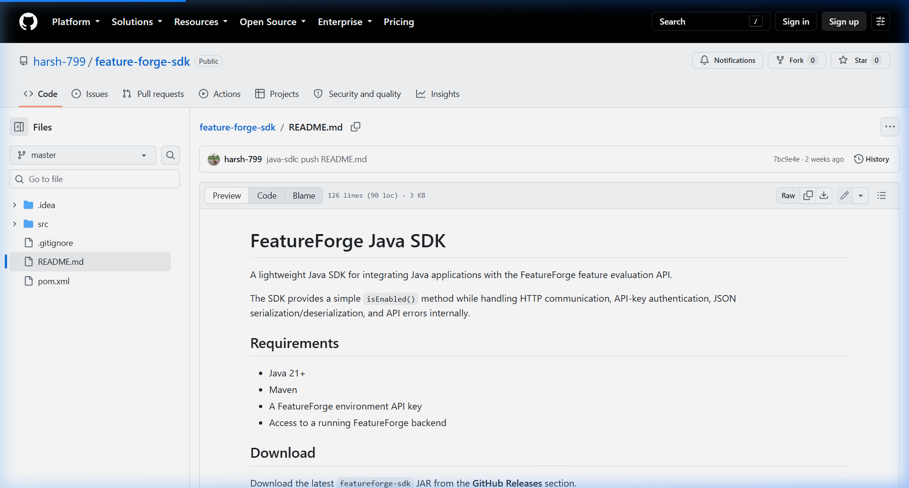

# FeatureForge

FeatureForge is a centralized feature flag and controlled rollout platform designed to separate code deployments from feature releases. It enables development teams to merge code to production continuously while retaining control over when, how, and to whom new features are exposed at runtime, without requiring redeployments.

---

## Why FeatureForge?

Traditionally, deploying code and releasing features are bound together. If a feature contains bugs, rollback requires redeploying previous code versions or emergency hotfixes. FeatureForge separates these concerns by wrapping new features in runtime conditionals (feature flags) evaluated dynamically against the FeatureForge service.

### Deployment vs. Release Lifecycle

```
Traditional Releases:
Merge Feature ──> Build / Deploy ──> 100% Users Exposed After Deployment ──> Bugs require redeploy rollback

FeatureForge Releases:
Merge behind flag ──> Build / Deploy ──> 0% Users Exposed ──> Tweak rollout % ──> 100% Release (Stable)
```

---

## Key Features

- **Isolated Environments:** Maintain separate configurations for `DEVELOPMENT` (100% exposure for easy sandboxing), `STAGING` (100% quality assurance testing), and `PRODUCTION` environments.
- **Controlled Rollouts:** Scale feature exposure in Production dynamically (e.g., 1%, 10%, 25%, 50%, 100%) to mitigate release risks.
- **Deterministic Hashing:** Group users into buckets based on the hashing code of their identifier to guarantee a consistent user experience.
- **Instant Kill Switch:** Toggling a flag off inside the dashboard immediately redirects evaluations to return `false` without Git merges or CI/CD rebuilds.
- **Compliance Audit Logs:** Complete traceability tracking operator accounts, action details, target environments, and timestamps.
- **Java SDK:** Dedicated native client handling HTTP communications, API key authentication, and error propagation.

---

## How It Works

### Flow Architecture
```
Developer ──> Configure Flag ──> FeatureForge Dashboard ──> Saves Config
                                                               │
                                                               ▼
Java App  ──> calls client.isEnabled() ──> POST /evaluate ──> FeatureForge API
```

### Runtime Evaluation Flow
```
Java Application ──> FeatureForge Java SDK ──> POST /api/v1/evaluate + X-API-Key ──> FeatureForge Backend ──> Evaluate Flag ──> Returns true/false
```

---

## Technical Stack

### Frontend
- **Framework:** React 19 (Vite)
- **Routing:** React Router DOM v7
- **Styling:** Vanilla CSS
- **Animations:** GSAP (GreenSock Animation Platform)
- **Utilities:** React Icons, React Toastify

### Backend
- **Framework:** Java 21 / Spring Boot 4.1.0
- **Security:** Spring Security (JWT authentication)
- **ORM & DB:** Spring Data JPA / Hibernate (PostgreSQL driver)
- **Utilities:** Project Lombok, Jackson

### Infrastructure
- **Docker:** Eclipse Temurin JDK 21 base image configuration.

---

## Database Schema

Below is the database entity relational layout of the FeatureForge platform. It models users, workspaces, invitations, environment setups, audit logs, and environment-specific feature flag configurations.



---

## Feature Flag Lifecycle & Retirement

Temporary release flags should be retired once the feature is fully rolled out and proven stable. Note that not every feature flag is temporary: operational flags (such as configuration switches or logging controls) can remain permanent components of your system.

```
Create Flag ──> Develop Behind Flag ──> Deploy Code ──> Gradual Rollout ──> Verify Stability ──> 100% Rollout ──> Retire Flag Check ──> Remove Old Code
```

### Code Cleanup Example

Once the feature is fully rolled out and stable, clean up the codebase.

**Before Cleanup (Conditional):**
```java
if (client.isEnabled("new-dashboard", userId)) {
    return newDashboard();
} else {
    return oldDashboard();
}
```

**After Cleanup (Permanent):**
```java
return newDashboard();
```

**Retirement Sequence:**
1. Clean up the codebase by removing the flag check and obsolete code path.
2. Deploy the modified application code.
3. Once verified, delete the corresponding flag configuration from the FeatureForge dashboard to keep your workspace tidy.

---

## Java SDK Integration

The official FeatureForge Java SDK is distributed as a JAR and can be integrated into any Java 21+ application.

**SDK Repository:** [https://github.com/harsh-799/feature-forge-sdk](https://github.com/harsh-799/feature-forge-sdk)

### Installation

Install the SDK JAR into your local Maven repository:
```bash
mvn install:install-file \
  -Dfile=featureforge-sdk-1.0.0.jar \
  -DgroupId=com.featureforge \
  -DartifactId=featureforge-sdk \
  -Dversion=1.0.0 \
  -Dpackaging=jar
```

Add the dependency block to your `pom.xml`:
```xml
<dependency>
    <groupId>com.featureforge</groupId>
    <artifactId>featureforge-sdk</artifactId>
    <version>1.0.0</version>
</dependency>
```

### Basic Usage

Initialize the `FeatureForgeClient` and perform evaluations:
```java
import com.featureforge.sdk.FeatureForgeClient;
import com.featureforge.sdk.exception.FeatureForgeException;

public class Main {
    public static void main(String[] args) {
        FeatureForgeClient client = new FeatureForgeClient(
            "YOUR_ENVIRONMENT_API_KEY",
            "YOUR_FEATUREFORGE_BACKEND_URL"
        );

        try {
            boolean enabled = client.isEnabled("INDEPENDENCE_DAY_HERO", "user_123");
            System.out.println("Feature active: " + enabled);
        } catch (FeatureForgeException e) {
            System.err.println("API Error " + e.getStatusCode() + ": " + e.getMessage());
        }
    }
}
```
*Note: A `false` response from `client.isEnabled()` is a valid flag evaluation state indicating the user is not selected for exposure. It does not represent an error.*

---

## API Overview

### POST `/api/v1/evaluate`
Evaluates a feature flag state directly over HTTP.

#### Headers
- `Content-Type`: `application/json`
- `X-API-Key`: `YOUR_ENVIRONMENT_API_KEY` (copied from the Environments tab)

#### Request Body
```json
{
  "featureKey": "INDEPENDENCE_DAY_HERO",
  "user": "user_123"
}
```

#### Response (200 OK)
```json
{
  "enabled": true
}
```

#### Error Response (400 Bad Request)
```json
{
  "success": false,
  "message": "Invalid API key provided"
}
```

---

## Getting Started

### Prerequisites
- Node.js (v18+)
- Java JDK 21
- Maven (v3.9+)
- PostgreSQL Database

### Clone Repository
```bash
git clone https://github.com/harsh-799/feature-forge.git
cd feature-forge
```

### Backend Setup
1. Create a PostgreSQL database instance.
2. Define the required environment variables:
   ```bash
   DATABASE_URL=your_database_url
   DATABASE_USERNAME=your_database_username
   DATABASE_PASSWORD=your_database_password
   JWT_SECRET=your_jwt_secret
   BREVO_API_KEY=your_brevo_api_key
   BREVO_SENDER_EMAIL=no-reply@featureforge.com
   BREVO_SENDER_NAME=FeatureForge
   BREVO_FRONTEND_URL=http://localhost:5173
   FEATUREFORGE_FRONTEND_URL=http://localhost:5173
   ```
3. Run the Spring Boot application:
   ```bash
   cd backend
   ./mvnw clean spring-boot:run
   ```

### Frontend Setup
1. Configure your API base URL in `frontend/.env`:
   ```env
   API_BASE_URL=http://localhost:8080
   ```
2. Build and run the developer server:
   ```bash
   cd frontend
   npm install
   npm run dev
   ```

---

## Project Structure

```
feature-forge/
├── backend/                  # Java 21 Spring Boot MVC Service
│   ├── src/                  # JPA Entities, Controllers, Filters, and Services
│   ├── Dockerfile            # eclipse-temurin compilation image
│   └── pom.xml               # Backend dependency coordinates
├── docs/                     # Documentation images and assets
│   └── database-schema.png   # PostgreSQL database schema layout
└── frontend/                 # React 19 Client SPA
    ├── src/                  # Landing components, Auth contexts, dashboard views
    ├── .env                  # API url configuration
    └── package.json          # Frontend dependencies
```
